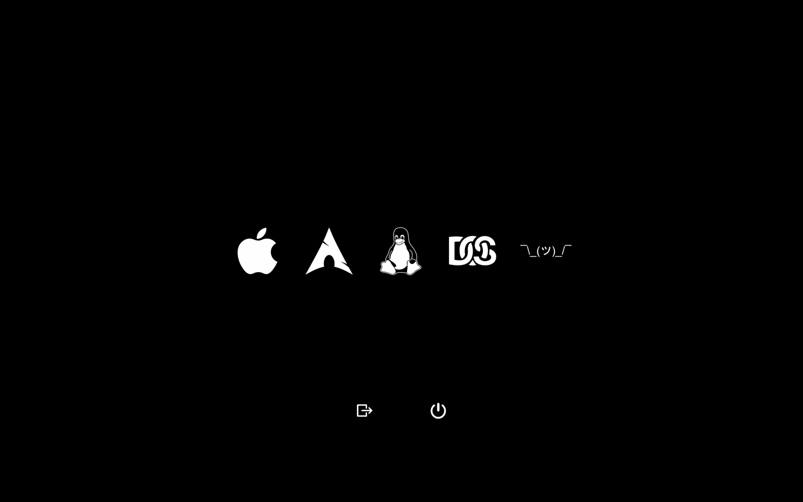

## rEFInd retina black

Minimalist rEFInd theme based off [rEFInd-minimal](https://github.com/EvanPurkhiser/rEFInd-minimal) with retina icons for macOS.

# installation + usage

**macOS**

1. [install rEFInd](https://sourceforge.net/projects/refind/)
2. unzip and run `./refind-install`
3. verify it works by restarting, you should be brought to the rEFInd menu
4. mount rEFInd `sudo mount -t msdos /dev/disk0s1 /Volumes`
5. `cd /Volumes/EFI/rEFInd`
6. Make a folder for your themes `mkdir -p themes`
7. Clone this repo `cd themes && git clone https://github.com/gretzky/refind-retina-black`
8. Add the theme to the refind config `cd .. && echo "include themes/refind-retina-black/theme.conf >> refind.conf`
9. Edit each menuentry in refind.conf to include the correct path to the themes icons
    - `/EFI/rEFInd/themes/refind-retina-black/os_whatever.png`
10. reboot